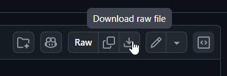

# Launching Server with Addons

### Prerequisites

**1. Install .NET 10 SDK** Download from [https://dotnet.microsoft.com/download/dotnet/10.0 ](https://dotnet.microsoft.com/download/dotnet/10.0)\
\
Run the installer. Verify with:

```
dotnet --version
```

**2. Install Git** Download from [https://git-scm.com/downloads ](https://git-scm.com/downloads)\
\
Run the installer (default options are fine). Verify with:

```
git --version
```

***

### Setup

**1. Place the launcher** Copy `dxrp-server.cs` into the same folder as `sbox-server.dll`.

```
steamapps/common/sbox/
├── sbox-server.dll
├── dxrp-server.cs        ← here
└── dxrp-server-config.json  ← created on first run
```

You can download **dxrp-server.cs** from: [Here](https://github.com/dxura/dxrp/blob/main/dxrp-server.cs)

&#x20;

\
**2. Run the launcher** Open a terminal in that folder and run:

```
dotnet run dxrp-server.cs
```

On first run it will:

* Create `dxrp-server-config.json` with default settings
* Ask for your server token if one isn't set

**3. Enter your server token** Paste your token when prompted, or pass it directly:

```
dotnet run dxrp-server.cs --token YOUR_TOKEN
```

The token is saved to config so you only need to do this once.

***

### What it does

Each startup the launcher will:

1. Pull the latest game code from GitHub
2. Fetch your addons from the DXRP API
3. Clear and re-download all addon files
4. Build and verify the code compiles
5. Launch the server and restart it automatically if it stops

***

### Config (`dxrp-server-config.json`)

| Key            | Default                | Description                               |
| -------------- | ---------------------- | ----------------------------------------- |
| `token`        | _(empty)_              | Your server token                         |
| `repoUrl`      | GitHub URL             | Repository to clone                       |
| `branch`       | `main`                 | Branch to pull                            |
| `apiEndpoint`  | `https://api.dxrp.net` | DXRP API URL                              |
| `map`          | _(empty)_              | Map to load on start (e.g. `dm_test`)     |
| `extraArgs`    | _(empty)_              | Any additional launch arguments           |
| `verifyAddons` | `true`                 | Set to `false` to skip build verification |

***

### Troubleshooting

**`sbox-server.dll not found`** Make sure you're running the launcher from the same folder as `sbox-server.dll`.

**`git exited with code 128`** Usually a network issue or bad repo URL. Check `repoUrl` in your config.

**`API error: ...`** Your token may be invalid or expired. Re-run with `--token YOUR_TOKEN`.

**Build errors shown on startup** The addon code failed to compile. Errors are shown with file and line number. Fix the issue in the addon or set `verifyAddons: false` to skip verification.
